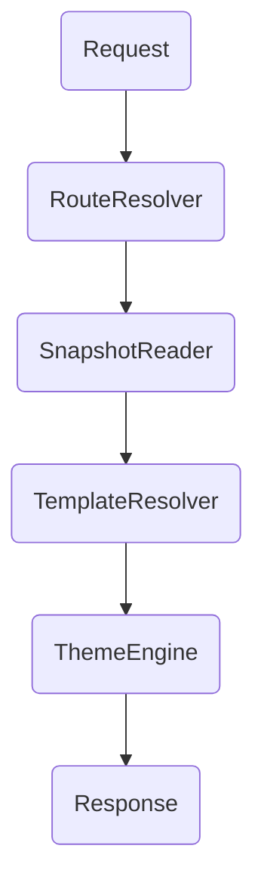

# Feat: Frontend Delivery & Rendering (P0 | Scope: L)

**Status:** Draft – will be refined once schema and snapshot layers stabilise.  
**Goal:** Render published content to the public site using Twig templates, navigation menus, and snapshots as the data source.

## Deliverables
- Catch-all controller under `src/Controller/Frontend` that resolves project + path, pulls data from `SnapshotReader`, and renders Twig templates bound to schema definitions.
- Error page handling (403/404/5xx) driven by entity assignments; fallback to static templates when mapping missing.
- Layout composition using theme module (if active) or default Twig layouts.
- Dynamic meta tags (title, description, OG tags) derived from snapshot metadata and schema fields.
- Multi-locale support: map `/en/...` vs `/de/...` based on project configuration.

## Routing & Resolution
- Route map stored in `snapshot.routes.json` per project: `{ "home": "/", "blog": "/blog/{slug}" }`.
- Catch-all controller steps:
  1. Resolve project via host or `X-Project` header fallback.
  2. Match incoming path to snapshot route definition; fallback to slug lookup.
  3. Load entity snapshot payload (`payload.json`) and schema reference.
  4. Select template using schema + theme overrides.
- Support canonical URL detection; redirect when slug mismatches (`/Blog` → `/blog`).

### Preview Mode Flow
1. Admin toggles preview; system issues signed token (`PreviewToken(project, entityId, expiresAt)`).
2. Token stored in cookie `aav_preview` and appended as query param for share links.
3. Middleware validates token signature + capability `content.preview`, attaches draft payload to request context.
4. Preview banner indicates draft state; share links expire (default 30 minutes).

## Integration Points
- Navigation Builder provides menus consumed by base layout.
- Schema/Template system supplies Twig templates referenced per entity type.
- Snapshot manager ensures fast lookup; caching layer adds HTTP caching headers.
- Feature flags allow preview mode (render draft via query param) for admins.

## Rendering Pipeline

- `SnapshotReader` returns DTO with `entity`, `schema`, `payload`, `meta`.
- `TemplateResolver` checks overrides: theme → module → default.
- Twig context includes `entity`, `project`, `navigation`, `preview` flag, `schema_helpers`.

## Implementation Steps
1. Implement routing strategy (project resolver + slug path) with cached lookup of route map.
2. Build `SnapshotReader` helpers for entity, listing, and related-content fetch.
3. Create base Twig layout with slots for navigation, breadcrumbs, content, footer.
4. Wire schema-based template resolution (e.g., `schema_render(entity)`).
5. Handle error pages and preview mode toggles.

## Error Handling
- Missing entity → render 404 entity if configured, else fallback template `errors/404.html.twig`.
- Unassigned 500 template → display minimal HTML with reference ID and log entry.
- Maintenance mode flag (from system settings) forces 503 responses with customizable body.

## Decisions (2025-10-30)
- Route resolution stays schema/slug driven; exotic routes rely on alias tables rather than custom controllers.
- Preview mode requires authenticated users with the `content.preview` capability; share links use short-lived signed tokens layered on top.
- JSON-LD helpers are opt-in per schema so templates decide when to emit structured data.
